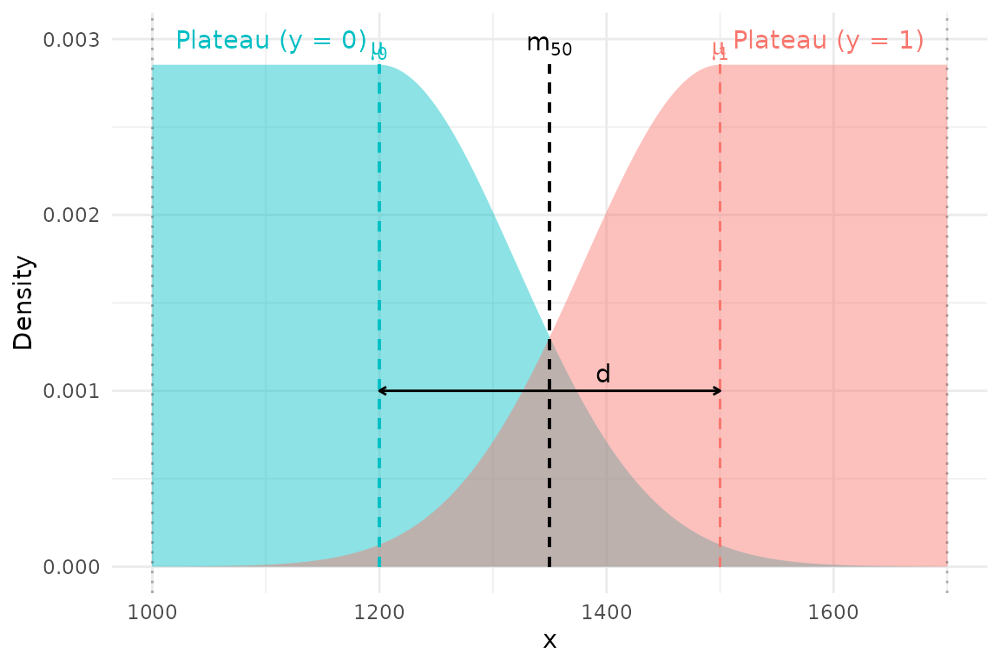

# Fitting the STAGE Model

## Fitting the STAGE model

This vignette shows how to:

- visualise the STAGE likelihood,
- fit the STAGE model to a simple simulated dataset,
- extract posterior transition points, and
- extend to a hierarchical (multi-population) model.

Conceptually, STAGE is a Bayesian generative classifier for estimating a
transition point (e.g. length at maturity).

Each class is fit with an asymmetric plateau–Gaussian density:

- the immature class has a **uniform plateau** followed by a **Gaussian
  tail down into the transition**,  
- the mature class has a **Gaussian tail up out of the transition**
  followed by a **uniform plateau**.

This construction focuses inference on the overlap region and prevents
distant observations (e.g. very small immatures, very large matures)
from unduly influencing the transition point.

### The STAGE likelihood

For a given truncation interval $\lbrack L,U\rbrack$ and transition
point $m_{50}$,

- the immature class ($y = 0$) has mean $\mu_{0} = m_{50} - d/2$,
- the mature class ($y = 1$) has mean $\mu_{1} = m_{50} + d/2$,

with a shared Gaussian spread $\sigma_{x}$ in the transition region and
a plateau outside:

- **Immature (left) density**  
  uniform over $\left\lbrack L,\mu_{0} \right\rbrack$, Gaussian for
  $x > \mu_{0}$
- **Mature (right) density**  
  Gaussian for $x < \mu_{1}$, uniform over
  $\left\lbrack \mu_{1},U \right\rbrack$

The **class-conditional densities** are normalised so each integrates to
1, and the transition probability $\Pr(y = 1 \mid x)$ arises from
**Bayes’ rule** by comparing the two densities.

#### Visualising a single STAGE transition

We can now visualise a simple STAGE configuration, showing:

- the immature and mature densities, and
- the resulting transition probability $\Pr(y = 1 \mid x)$.

``` r
# parameters for the illustration
L      <- 1000
U      <- 1700
sigma  <- 120
m50    <- 1350           # mid point
d      <- 300            # separation
mu0    <- m50 - d/2      # 1200
mu1    <- m50 + d/2      # 

pdat <- tibble(x = L:U) |> 
  rowwise() |> 
  mutate(
    "y=0" = plateau_gaussian_density_left(
      x, mu = mu0, sigma = sigma, L = L),
    "y=1" = plateau_gaussian_density_right(
      x, mu = mu1, sigma = sigma, U = U)
  ) |> 
  pivot_longer(
    cols = c(`y=0`, `y=1`),
    names_to = "Class",
    values_to = "Density"
  )


# base plot
ggplot(pdat) + 
  aes(x=x, y=Density, fill=Class) +
  geom_area(position = "identity", alpha = 0.5)
```


``` r

# maximum density
maxd <- max(pdat$Density)

p <- ggplot(pdat) +
  aes(x = x, y = Density, fill = Class) +
  geom_area(alpha = 0.45, position = "identity") +
  scale_fill_manual(values = c("#00BFC4", "#F8766D")) +
  labs(
    x = "x",
    y = "Density",
    fill = "State"
  ) +
  theme_minimal() +
  theme(legend.position = "none")

# add labelled structure
p +
  # vertical lines for key parameters
  geom_segment(aes(x = mu0, xend=mu0, y=0, yend=maxd), linetype = 2, colour = "#00BFC4") +
  geom_segment(aes(x = mu1, xend=mu1, y=0, yend=maxd), linetype = 2, colour = "#F8766D") +
  geom_segment(aes(x = m50, xend=m50, y=0, yend=maxd),  linetype = 2, colour = "black") +
  geom_vline(xintercept = L,    linetype = 3, alpha = 0.3) +
  geom_vline(xintercept = U,    linetype = 3, alpha = 0.3) +

  # annotate regions
  annotate("text", x = L + 20,  y = 0.003, label = "Plateau (y = 0)", colour = "#00BFC4", hjust = 0) +
  annotate("text", x = U - 20,  y = 0.003, label = "Plateau (y = 1)", colour = "#F8766D", hjust = 1) +

  annotate("text", x = mu0, y = maxd, label = expression(mu[0]), colour = "#00BFC4", vjust = -0.4) +
  annotate("text", x = mu1, y = maxd, label = expression(mu[1]), colour = "#F8766D", vjust = -0.4) +
  annotate("text", x = m50, y = maxd, label = expression(m[50]), vjust = -0.5) +

  # illustrate d
  annotate("segment",
           x = mu0, xend = mu1, y = 0.001, yend = 0.001,
           arrow = arrow(ends = "both", length = unit(0.12, "cm"))) +
  annotate("text", x = m50*1.03, y = 0.001*1.05, label = "d", vjust = 0, hjust = 0)
```



## Simulating data

To demonstrate the workflow, we simulate a simple dataset of lengths in
$\lbrack L,U\rbrack$ with a smooth transition around a true $m_{50}$.

``` r
N <- 200
L <- 1000
U <- 1500
true_m50 <- 1250
true_d   <- 100

# Simulate covariate
x <- runif(N, L, U)

# Smooth transition in P(mature)
p <- plogis((x - true_m50) / (true_d / 4))

# Binary maturity indicator
y <- rbinom(N, 1, p)

head(tibble(x = x, y = y))
#> # A tibble: 6 × 2
#>       x     y
#>   <dbl> <int>
#> 1 1133.     0
#> 2 1186.     0
#> 3 1286.     1
#> 4 1454.     1
#> 5 1101.     0
#> 6 1449.     1
```

## Fitting the STAGE model

We now fit the STAGE model using
[`fit_stage()`](https://anhsmith.github.io/stage/reference/fit_stage.md).  
Because STAGE is a Bayesian model fit via Stan, we keep `chains` and
`iter` small in this vignette to keep runtime acceptable; for real
applications you should increase these.

``` r
fit <- fit_stage(x, y, L = L, U = U, chains = 2, iter = 1000)
fit
```

You can inspect the posterior with standard tools such as
`summary(fit$fit)`, `bayesplot`, or `posterior` utilities if you want
more diagnostics.

### Extracting the transition point

The helper
[`transition_point()`](https://anhsmith.github.io/stage/reference/transition_point.md)
returns posterior summaries of the global transition point $m_{50}$.

``` r
transition_point(fit)
```

Typical output is a small data frame with posterior mean, median, and
credible intervals for `m50`.

### Predicting maturity probabilities

We can also predict $\Pr\left( \text{mature} \mid x \right)$ over a grid
of lengths, and plot the posterior mean transition curve.

``` r
x_grid <- seq(L, U, length.out = 200)

p_hat <- predict(fit, x_grid, type = "prob")

plot(
  x_grid, p_hat, type = "l",
  xlab = "Length (x)",
  ylab = "P(mature)",
  las = 1
)
```

## Hierarchical (multi-population) model

In many applications we have multiple populations (e.g. regions, stocks,
or sexes) and we expect:

- a **shared average transition point** $\mu_{m50}$, and
- **population-specific deviations**.

STAGE implements this using a hierarchical structure
$$m50_{\text{pop}{\lbrack j\rbrack}} = \mu_{m50} + z_{j}\,\sigma_{\alpha},$$
with a non-centred parameterisation for efficient sampling.

A simple two-group example:

``` r
group <- rep(c("A", "B"), each = N/2)

fit2 <- fit_stage(
  x, y,
  group = group,
  L = L, U = U,
  chains = 2, iter = 1000
)

transition_point(fit2)
```

`transition_point(fit2)` returns both:

- a global `m50` (overall mean transition)  
- group-specific `m50_pop[j]` values.

## Summary

In this vignette we:

- introduced the plateau–Gaussian likelihood underlying STAGE,
- visualised the class densities and resulting transition probabilities,
- simulated a simple dataset,
- fit the STAGE model to estimate the transition point, and
- extended the model to a hierarchical multi-population setting.

In practice, you will want to:

- choose $\lbrack L,U\rbrack$ to capture the transition zone plus some
  plateau on each side,
- check posterior diagnostics (divergences, R-hat, effective sample
  sizes),
- and interpret $m_{50}$ and its uncertainty in the biological context.

Future vignettes will expand on:

- comparing STAGE to logistic regression and Gaussian LDA, and
- sensitivity to the choice of $\lbrack L,U\rbrack$ and prior settings.
