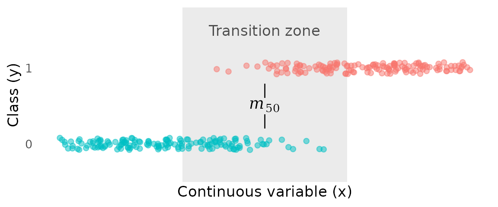
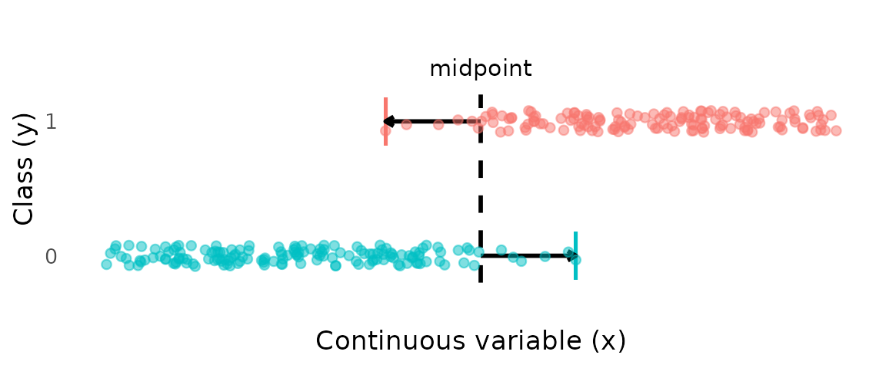
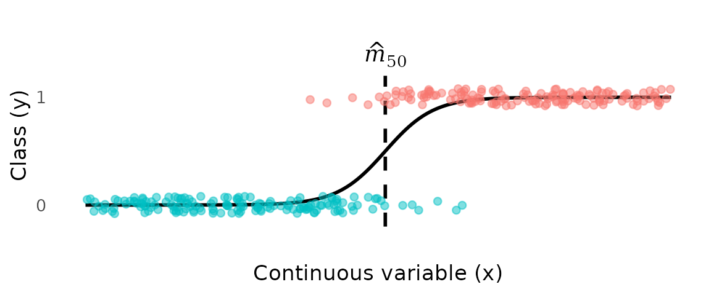
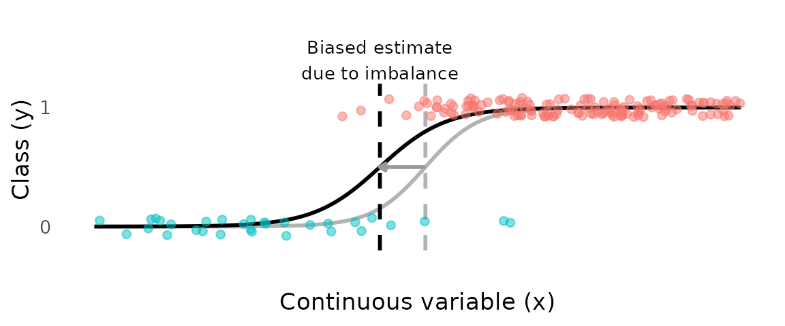
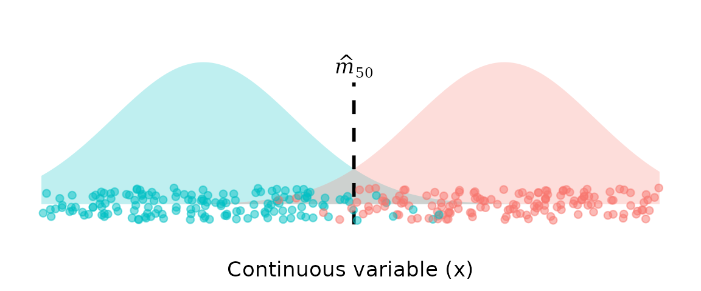
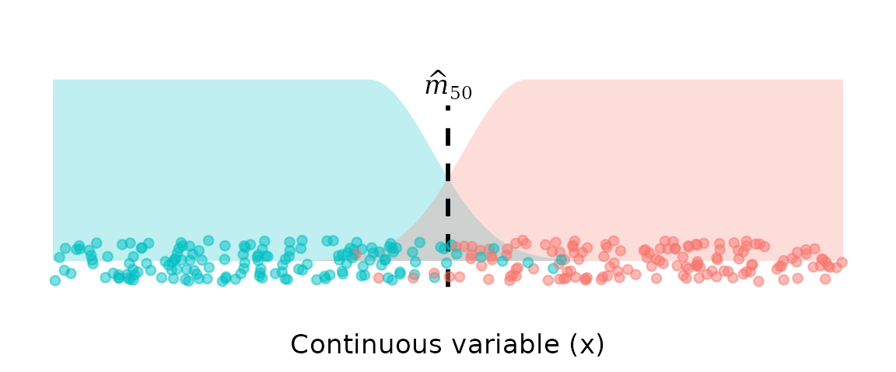

# Motivation

## The goal

Estimating a transition point between two classes—the point along a
continuous variable $x$ where the probability shifts from one class to
the other for binary variable $y$—is a simple and common task. For
example, the length at which individuals of a species shifts from
immature to mature is an important life-history parameter.

Given the data below, we can easily identify a broad “transition
*zone*”, where the transition from class 0 to class 1 takes place.
However, a more specific goal is to estimate the “transition *point*”,
or $m_{50}$—the value of $x$ where the probability of being in class 1
reaches 50%.

${\widehat{m}}_{50} = \{ x:\widehat{\Pr}(y = 1 \mid x) = 0.5\}$

In maturity studies, this point might be called “length at maturity”. To
the left of $m_{50}$, class 0 is more likely; to the right of $m_{50}$,
class 1 is more likely.

## Problems with existing methods

The statistical methods typically applied to this task are based on
inappropriate assumptions and likely produce biased estimates of
transition points.

Below, we discuss three current approaches, highlighting the limitations
of each.

### Ad hoc midpoint methods

A common approach is to avoid fitting a model altogether and instead
compute a transition point directly from the data. One such method is to
take the midpoint between the smallest mature and largest immature
individuals. The advantage of this approach is that it focuses on the
transition zone only. However, this approach (1) has no probabilistic
foundation and so cannot quantify uncertainty, and (2) uses only two
data points, so has high variance.

### Discriminative models (e.g., logistic regression)

Discriminative models such as logistic regression estimate the
conditional probability $P(y = 1 \mid x)$*directly*. In other words, the
model focuses on predicting class labels based on the prevalence of one
class vs another at each value of $x$.

In logistic regression, a logistic curve is fit to the data, and the
estimate of the transition point $m_{50}$ is defined as the value of $x$
where the fitted probability equals 0.5.

While simple and familiar, *logistic regression (and other
discriminative models) are highly sensitive to class imbalance*. The
discriminative model estimates the probability of class in the sample,
not the population.

Unless sampling is independent of both class and size, the estimated
curve can be seriously biased. If one class has a much greater sample
size than the other (i.e., they are unbalanced), logistic regression
effectively places more weight on the more abundant class. This pulls
the estimated transition curve toward the majority class, even though
class counts should not determine where the transition occurs.

In the plot below, 85% of the class 0 observations have been removed,
resulting a highly imbalanced dataset and a biased estimate of $m_{50}$.

An advantage of the discriminative-model approach (over other methods)
is that inferences about the transition point are based mainly on data
near the transition zone.

### Generative models (e.g., Linear Discriminant Analysis)

Generative models (often called generative classifiers) are an
alternative approach to discriminative models. They model the
class-conditional densities

$f(x \mid y = 0),\qquad f(x \mid y = 1)$,

and then obtain $P(y = 1 \mid x)$*via* Bayes’ rule (usually applied with
equal prior probabilities).

As with discriminative models, the estimate of $m_{50}$ is then defined
as the value of $x$ where the two class densities are equal, i.e., where
$f(x \mid y = 0) = f(x \mid y = 1)$.

The generative classifier approach has the advantage of being less
sensitive to class imbalance, since the transition point estimate
depends on the shapes of the class distributions, not their relative
sample sizes. This is achieved by fitting a density to each class
separately, and then calculating the transition point based on the
relative densities of the two classes. Linear Discriminant Analysis
(LDA) is a widely used generative classifier that fits a Gaussian
(Normal) density to each class.

This approach is less sensitive to class imbalance, they can suffer from
another important limitation: *estimates of transition points from LDA
(and other generative models) are potentially influenced by all values
of $x$, not just those near the transition zone*.

Observations far from the transition zone greatly affect the fitted
density for that class, and therefore have undue influence on the
estimate of the transition point. For example, if the true transition is
around 1000 mm, individuals at 200–400 mm should not influence the
estimate of the maturity transition.

*In LDA, because symmetrical Gaussian distributions are fit to each
class, the behaviour of the tails near the transition are determined as
much by the very lowest and highest values of $x$ as by those near the
transition.*

In the context of length-at-maturity, this means that very small
immature individuals (e.g., neonates) and very large mature individuals
have as much influence on the transition point as individuals whose
lengths fall near the maturity boundary. This is unappealing, because
these distant observations contain almost no information about the
location of the transition, yet they shape the Gaussian fits and can
shift the inferred transition point substantially.

Furthermore, the two tails that actually matter for the transition—the
upper tail of the immature class and the lower tail of the mature
class—are not modelled directly against each other. Instead, each tail
is constrained to be the mirror image of the opposite tail of its own
class (because of the global, class-wise, Gaussian assumption).

------------------------------------------------------------------------

## Summary

Data can be subject to all sorts of sampling biases, favouring one class
over another, or certain values of $x$ over others. Often, these biases
are unknown and uncontrollable. These sampling biases can seriously
distort estimates of transition points in known ways.

Therefore, methods that are robust to these biases are needed.

What is needed is a model for estimating transition points that:

- is probabilistic and can quantify uncertainty,
- robust to class imbalance, and
- focuses inference on data in the overlap region rather than distant
  data.

------------------------------------------------------------------------

## The STAGE solution

The STAGE model is a Bayesian generative classifier where each class is
fit with an **asymmetric Uniform–Gaussian mixture**.

- **Immature (y = 0):**  
  uniform plateau → Gaussian decay approaching the transition.
- **Mature (y = 1):**  
  Gaussian rise out of the transition → uniform plateau.

This model has several key consequences:

#### Robust to class imbalance

STAGE (like LDA) is a generative model, so it is far less affected by
class imbalance. Inferences about $m_{50}$ depend on the **relative
shapes** of the class-conditional densities, rather than the number of
observations in each class at any particular value of $x$. In contrast,
discriminative models (e.g., logistic regression) are highly sensitive
to class imbalance because they implicitly use the empirical class
frequencies as priors.

#### Focus on data in the transition zone

Observations far from the transition zone enter via the **uniform**
component, so they have little influence on the estimate of the
transition point. Individuals that provide no information about the
boundary contribute only a constant term to the likelihood.

#### Decline in one class is matched with increase in the other

In many transition problems (such as length at maturity), the density of
the lower class must decline in exactly the region where the
higher-class density increases. STAGE encodes this by fitting a **shared
standard deviation** to the upper tail of the lower class and the lower
tail of the higher class. By jointly modelling these tails, any change
in one class’s decline implies a matching change in the other’s rise.
This ensures that the estimated transition point is driven by the
**relative** behaviour of the two densities, not by the marginal
behaviour of either class on its own.

#### Bayesian inference

STAGE is presented under a Bayesian paradigm, providing the flexibility
to incorporate prior information and to quantify uncertainty in any
derived parameter or quantity. Multi-population structure is handled
naturally through a hierarchical model: uncertainty in the densities
propagates directly to uncertainty in $m_{50}$, and population-level
patterns can be estimated efficiently.

The STAGE likelihood is a structured mixture inspired by the
plateau–Gaussian formulation of Lau & Krumscheid (2022), adapted
specifically for transition-point estimation.

## References

Lau, F. Din-Houn, and Sebastian Krumscheid. 2022. “Plateau Proposal
Distributions for Adaptive Component-Wise Multiple-Try Metropolis.”
*METRON* 80 (3): 343–70. <https://doi.org/10.1007/s40300-022-00235-y>.
